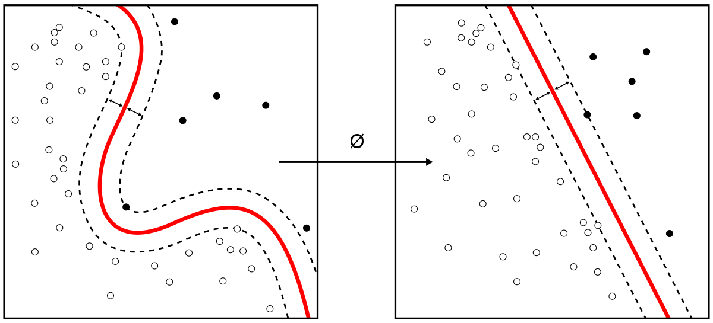
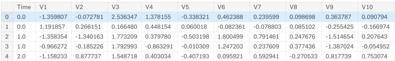
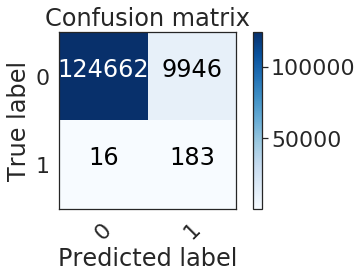

# Fraud Detection

- Fraud Detection is a topic applicable to many industries including banking and financial sectors, insurance, government agencies and law enforcement, and more.
- Fraud attemps have seen a drastic increase in recent years, making fraud detection more important than ever.
- Despite efforts on the part of the affected institutions, hundreds of millions of dollars are llost to fraud every year.

According a report published by NIlson, in 2017 the worldwide losses in card fraud related cases reached 22.8 billion dollars. The problem is forecasted to get worse in the following years, by 2021, the card fraud bill is expected to be 32.96 billion dollars.

# Methodolgies involved in day to day life to stop Fraud.
For years, fraudsters would simply take numbers from __credit__ or __debit cards__ and print them onto blank plastic cards to use at brick-and-mortar stores. But in 2015, __Visa__ and __Mastercard__ mandated that banks and merchants introduce __EMV__--chip card technology, which made it possible for merchants to start requesting a PIN for each transaction.  
In addition to the implementation of chip card technology, companies have been investing massive amounts in other technologies for detectinf fraudulent transactions. 
Would __Machine Learning and AI__ constitute great allies in the battle?

# Classification Problems

In __Machine learning__, problems like fraud detection are usually framed as classification problems -- predictinf a discrete class label output given a data observation. 
Talking about the credit card payment fraud detection, the classification problem involves creating models that have enough intelligence in order to properly classify transactions as either __legit__ or __fraudulent__, based on transaction details such as __amount__, __merchant__, __location__, __time__ and others. 

Financial fraud still amounts for considerable amounts of money. Hackers and crooks around the world are always looking into new ways of committing financial fraud at each minute. Relying exclusively on rule-based, conventionally programmed systems for detecting financial fraud would not provide the appropriate time-to-market. This is where __Machine Learning__ shines as a unique solution for this type of problem.

The main challenge when it comes to modeling fraud detection as a classification problem comes from the fact that in real world data, the majority of transactions is not fraudulent. Investment in technology for fraud detection has increased over the years so this shouldn’t be a surprise, but this brings us a problem: __imbalanced data__.

# Imbalanced Data
Imagine that you are a teacher. The school director gives you the task of generating a report with predictions for each of the students final year result: pass or fail. You're supposed to come up with these predictions by analyzing student data from previous year:__grades__, __absences__, __engagement__, together with the final result, the target variable -- which could be either __pass__ or __fail__. You must submit your report in some minutes.tudents have passed final

The problem here is that you are a very good teacher. As a result, almost none ofyour past students has failed your classes. Let's say that 99% of your students have passed final year exams.

What would you do?

The most __fast__, __straightforward__ way to proceed in this case would be predicting that __100% of all your students would pass__. Accuracy in this case would be __99%__ when simulating past years. Not bad, right?  
Would this “model” be correct and fault proof regardless of characteristics from all your future student populations?

Certainly not. Perhaps you wouldn’t even need a teacher to do these predictions, as anyone could simply try guessing that the whole class would pass based on data from previous years, and still achieve a good accuracy rate. Bottomline is that this prediction would have no value. And one of the most important missions of a __Data Scientist__ is creating business value out of data.  
We’ll take a look into a practical case of fraud detection and learn how to overcome the issue with imbalanced data.

# Data

- The dataset contains transactions made by credit card in September 2013 by european cardholders.
- Presents transaction that occured in two days, where we have __492 fruads__ out of __284,807 transactions__.
- Dataset is highly __imbalanced__, with the positive calss (frauds) accounting for 0.172% of all transactions.

It is important to note that due to confidentiality reasons, the data was aninymized -- variable names were renamed to V1, V2, V3 until V28. 
Moreover, most of it was scaled, except for __Amount__ and __Class__ variables, the latter being our binary, target variable.

# EDA

There are many ways of dealing with imbalanced data. We will focus here on "UnderSampling" process.

- For the model analysis we have used SVM to train and test the model. 

In this case we are gonna try to minimize the number of errors in our prediction results. Errors are on the anti-diagonal of the confusion matrix. But we can infer that being wrong about an actual fraud is far worse than being wrong about a non-fraud transaction.  

That is why using the accuracy as only classification criterion could be considered unthoughtful. During the remaining part of this study our criterion will consider precision on the real fraud 4 times more important than the general accuracy. Even though the final tested result is accuracy.

__Our criterion give a result of 0.9208987440186684__  
__We have detected 183 frauds / 199 total frauds__.

__So, the probability to detect a fraud is 0.9195979899497487__ 
__The accuracy is : 0.9261017602943468__

