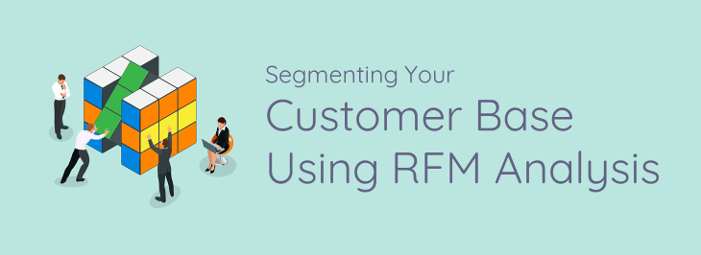
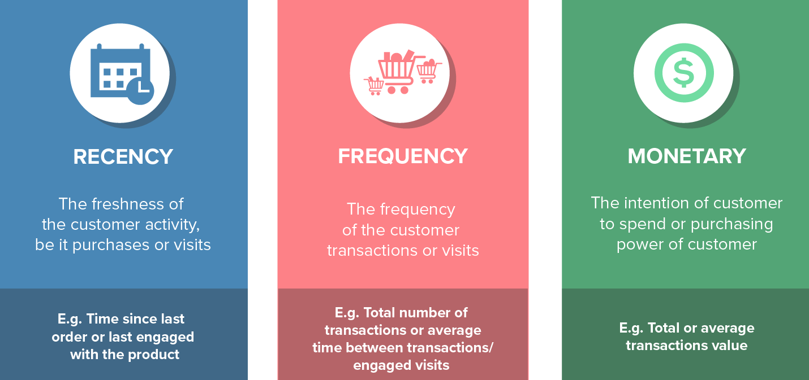
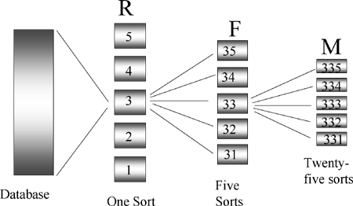
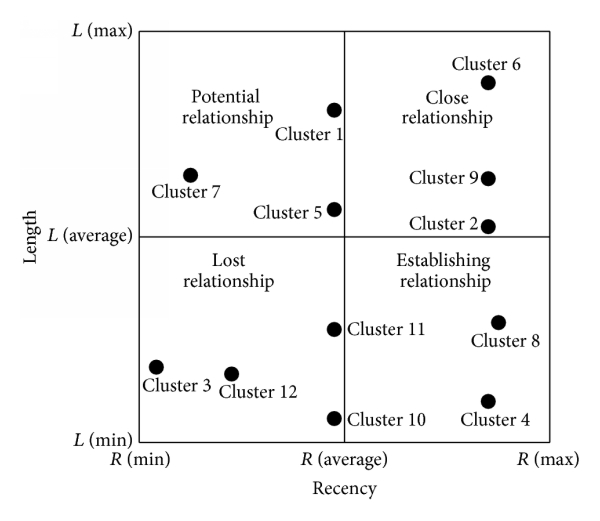

# RFM principle to cluster customers using K-means

## Introduction

Who is your Customer? Sometime it is not very obvious or short to answer this. There are lots of ways to classify customers and divided them by groups. But since we have data, let's use data approach to answer this question.  
When yu have data -- like a list of customers and what they bough -- and you need to create groups with similar characterestics using this data, we need a clustering approach. 

- __Clustering__ is part of the unsupervised machine learning techniques.
- It is unsupervised as the mahine has no previous information about how it should group the entities.
- They try to create clusters with similar entities by analysinf how close they are one from another.

## RFM Analysis
- While planning for marketing spend, or formulating a new promotion, retail marketers need to be careful about how they segment and target customers. 
- It would be a waste of marketing spend if, for example, an ad campaign is targeted to all the thousands of your customers.
- Such an untargeted marketing promotion is unlikely to have a high conversionr ate and may even hurt your brand value.
- RFM Analysis is one such popular customer segmentation technique that can help retailers maximize the return on their marketing investments. 

- Under RFM analysis, each customer is scored based on three factors, namely __Recency__, __Frequency__ and __Monetary__ value.
  - __Recency__: 
    - The most important predictor of who is more likely to respond to an offer.
    - Customers who have purchased recently from you are more likely to purchase again from you compared to those who did not purchase recently.
  - __Frequency__:
    - How frequently these customers purchase from you.
    - The higher the frequency, the higher is the chances of them responding to your offers.
  - __Monetary__:
    - The amount of money these customers have spent on purchases.
    - Customers who have spent higher are more likely to purchase based in the offer compared to those who have spent less.
    

## How it Works?

 
To perform RFM analysis, each customer is assigned a score for recency, frequency, and monetary value, and then a final RFM score is calculated.

- Recency score is calculated based on the date of their most recent purchase. 
- The score are generally based on the values.
  - For example, a company may follow a category system of 1 to 5 score, score of 5 being the highest.
  - In this case, customers who purchased within the last month have a recency score of 5.
  - Customers who purchased within the last 1-3 months have a score of four and so on.
  
- Frequency score is calculated based on number of times the customers purchased.
- Customers with higher frequency receive a higher score.

- Monetary score are based on the amount they spent on their purchases.
- For calculating this, we may need to consider the actual amount spent or avergae spent per visit.

By Combining these three scores, a final RFM score is calculated. The customers with the highest RFM score are cosnidered to be the ones that are most likely to respond to their offers.

## Customer Segmentation
RFM analysis can help retailers segment the customers and design offers and promotions based on their profile. Below are a few examples: 

- Customers with an overall high RFM score represent the best customers.
- Customers who have a high overall RFM score but a frequency score of 1 are new customers. The company can provide special offers for these customers in order to increase their visits.
- Customers who have a high frequency score but a low recency score are those customers that used to visit quite often but have not been visiting recently. For these customers, the company needs to offer promotions to bring them back to the store, or run surveys to find out why they abandoned the store.
- RFM scores can be analysed together with the results of the campaigns to eliminate non-responsive customers and further improve the campaigns.
- RFM score can be analysed together with the products they purchase to design highly targeted offers for each customer segment.
R- FM score can be analysed together with other information about the customers such as their income levels, gender, whether they own a vehicle or nor, etc. to segment the customers.

## RFM Limitations
The primary limitation of RFM model is the absence of Length entity. 
1. RFM model lacks of smart linking between the three indices.
2. The customer segmentation used in it. Most of the analysts usially split in customer values into 5 bands.

## LRFM Takes INitial RFM Model to Next Level
Various studies have concluded that the addition of an extra variable to the initial RFM Model can magnify its predictability of customer behaviors. 

Just an addition of customer relation length (L) to RFM Model results in the extended reliability and accuracy of customer segments. By adopting the traditional RFM Model, companies cannot distinguish between the long-term and short-term customers, which becomes possible with the LRFM Model.

The inclusion of Length Element (L)  to the RFM Model resolves the inability to properly analyze different product demands at different times. In order to identify the most loyal customers of a company, it is essential to consider the Length of customer relation.

The objective of adapting and implementing any of RFM and LRFM Model is to build revenue generating customer segments. No doubt, LRFM Model is much more favorable than RFM Model to get the desired productivity.

## Data
The dataset is taken from UCI repository. 
Visit the link to download the data - https://archive.ics.uci.edu/ml/datasets/Online+Retail 
This data set is composed of 8 attributes and 541909 instances showing all the transactions occurring between 01/12/2010 and 09/12/2011 for a UK-based online retail.  According to UCI, the company mainly sells unique all-occasion gifts and many customers of the company are wholesalers.

### Attributes Information
- __InvoiceNo__: Invoice number. Nominal, a 6-digit integral number uniquely assigned to each transaction. If this code starts with letter 'c', it indicates a cancellation. 
- __StockCode__: Product (item) code. Nominal, a 5-digit integral number uniquely assigned to each distinct product. 
- __Description__: Product (item) name. Nominal. 
- __Quantity__: The quantities of each product (item) per transaction. Numeric.	
- __InvoiceDate__: Invice Date and time. Numeric, the day and time when each transaction was generated. 
- __UnitPrice__: Unit price. Numeric, Product price per unit in sterling. 
- __CustomerID__: Customer number. Nominal, a 5-digit integral number uniquely assigned to each customer. 
- __Country__: Country name. Nominal, the name of the country where each customer resides.

