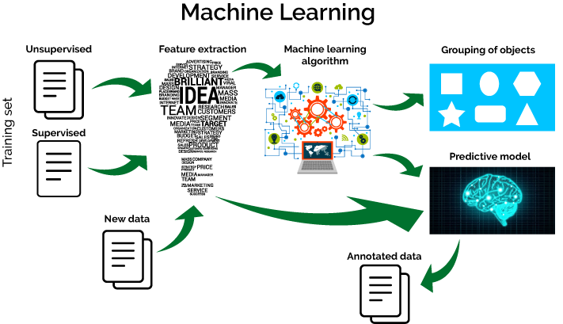

# MachineLearningUsingPython
  
Machine Learning is a latest __buzzword__ floating around. It desrves to, as it is one of the most interesting subfield of Computer Science. 
__What does Machine Learning really means?__ 
Machine Learning is an application of artificial intelligence(AI) that provides systems the ability  to automatically learn and improve from experience without being explicitly programmed. 
__Machine Learning focuses on the development of computer programs__ that can access data and use it to learn for themsleves. 
The process of learning begins with data, such as, direct experience, or instruction, in order to look for patterns in data and make better decisions in the future based on the examples that we provide. __The primary aim is to allow the computers learn automatically__ without human intervention or assistance and adjust actions accordingly.
  

## Repository Overview
This repository is about different Machine Learning algorithm approaches as per the industry practices.

## Table of Contents
- [Telecom Churn Prediction](#section1) 
- [Credit Fraud Detection](#section2) 
- [Spam Detection](#section3) 
- [Customer Segmentation using RFM Analysis](#section4) 

___

### [Telecom Churn Prediction](./TelecomChurn)
  
- A churn with respect to the Telecom industry, is defined as the percentage of __subscribers moving__ from a specific service to a service provider to another in a period of time.
- Research shows that the companies have an __avergae churn of 1.9 to 2 percent__ month on month and annualized churn ranging from 10 to 60 percent.
- An effort to build a model which helps in reducing the churn rate for a telecom company.
- [Link for the Jupyter notebook](./TelecomChurn/Telco_Churn.ipynb)

___

### [Credit Fraud Detection](./CreditCardFraud)
  
- Credit card fraud is a wide-ranging term for __theft__ and __fraud committed__ using or involving a payment card, such aas credit or debit card, as  __fraudulent source__ of funds in a transaction. 
- The purpose may be to obtain goods without paying, or to obtain __unautorized funds from an account__.
- Credit card fraud is also and adjunt to __identity__ theft.
- Building a robust model so that credit card companies are able to recognize the fraudulent card transactions so that customets are not charged for items that they did not purchase.
- [Link for the Jupyter notebook](./CreditCardFraud/CreditFraud.ipynb)

___

### [Spam detection](./SpamDetection)
  
- This is a beginner's example of __document classification__ task which involves __classifying__ an email as spam or not spam mail.
- Spam box in your __Gmail account__ is the best example of this.
- [Link for the Jupyter notebook](./SpamDetection/Spam&Ham.ipynb)

___

### [Customer Segmentation using RFM Analysis](./CustomerSegmentationUsingRFM)
  
- Businesses that __lack__ the monetary aspect, like __viewership__, __readership__, or __surfing-oriented products__, could use __Engagement parameters__ instead of Monetary factors.
- The Engagement parameter could be defined as a composite value based on metrics such as __bounce rate__, __visit duration__, __number of pages visted__, __time spent per page__ etc.
- RFM stand for __Recency__, __Frequency__ and __Monetary__.
- [Link for the Jupyter notebook](./CustomerSegmentationUsingRFM/Clustering.ipynb)

## Projects in execution

