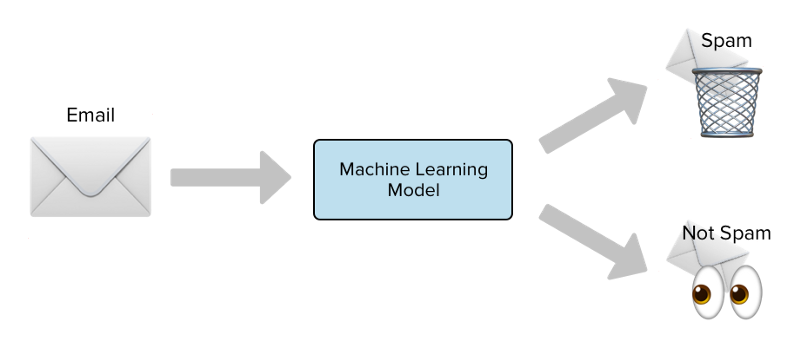
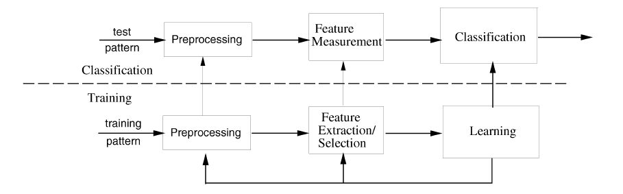
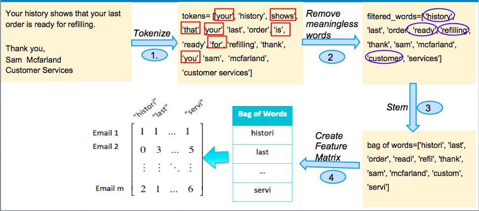

# Email Spam Filtering
The idea of the repo is to understand step by step working of the spam filter and how it helps in making everyone life easier.
Also, next time when you see a "You have won a lottery" email rather than ignoring it, you might prefer to report it as a spam. 
 
The image gives an overview of spam filtering, plenty of emails arrive everyday, some goes to spam and rest stays in your primary inbox.
- The blue box in the middle - Machine Learning model, how does it decide which mail is spam and which one is not.

## Gmail Spam Detection
We all know the data Google has, is not obviously in paper files. They have data centers which maintain the customers data. Before Google/Gmail decides to segregate the emails into spam or not spam category, before it arrives to your mailbox, hundreds of rules apply to those email in the data centers. These rules describe the properties of a spam email. There are common types of spam filters which are used by Gmail/Google —

- __Blatant Blocking__ - Deletes the emails even before it reaches to the inbox.
- __Bulk Email FIlter__ - This filter helps in filtering the emails that are passed thorugh other categories but are spam.
- __Category Filters__ - User can define their own rules which will enable the filtering of the messages according to the specific content or the email addresses etc.
- __Null Sender Disposition__ - Dispose of all messages without an SMTP envelope sender address. Remember when you get an email saying, “Not delivered to xyz address”.
- __Null Sender Header Tag Validation__ - Validate the messages by checking security digital signature.

## Basic Approach
When we choose to approach spam filtering from a machine learning perspective, we view the problem as a classification problem. That is, we aim to classify an email as spam or not spam (ham) depending on its features. In our case, the features are the count of each word in the email. 

A machine learning system operates in two modes: training and testing. 

- __Training__:
  - During training, the machine learning system is given labeled data from a training data set. 
  - The labeled training data are a large set of emails that are labeled spam or not spam (ham). 
  - During the training process, the classifier (part of the machine learning system that actually predicts labels of future emails) learns from the training data by determining the connections between the features of an email and its label.
  
- __Testing__:
  - During testing, the machine learning system is given unlabeled data. 
  - These data are emails without the spam/ham label. 
  - Depending on the features of an email, the classifier predicts whether the email is spam or ham. 
  - This classification is compared to the true value of spam/ham to measure performance.

## Pre Processing
After preliminary pre-processing (removing HTML tags and headers from the email in the data set), we take the following steps:
1. __Tokenize__ - We create "tokens" from each word in the email by removing punctuation.
2. __Remove meaningless words__ -  The text in red squares are stop-words, which should be removed. Stop-words do not provide meaningful information to the classifier, and they increase dimensionality of feature matrix. In addition to many stop-words, we removed words over 12 characters and words less than three characters.
3. __Stem__ -  The text in blue circle is converted to its "stem". Similar words are converted to its stem in order to form a better feature matrix. This allows words with similar meanings to be treated the same. For example, history, histories, historic will be considered same word in the feature matrix. Each stem is placed into our "bag of words", which is just a list of every stem used in the dataset. 
4. __Create feature matrix__ - After creating the "bag of words" from all of the stems, we create a feature matrix. The feature matrix is created such that the entry in row i and column j is the number of times that token j occurs in email i. 

[Link to jump directly to Jupyter Notebook](./Spam&Ham.ipynb)

