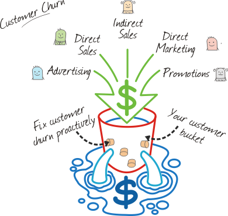

# Customer Attrition
  
Customer __attrition__, also known as customer __churn__, customer __turnover__, or customer __defection__, is the __loss of clients or customers__.

Telephone service companies, Internet service providers, pay TV companies, insurance firms, and alarm monitoring services, often use customer attrition analysis and customer attrition rates as one of their __key business metrics__  because the __cost of retaining an existing customer is far less than acquiring a new one__. Companies from these sectors often have __customer service__ branches which attempt to __win back defecting clients__, because recovered __long-term customers__ can be worth __much more__ to a company than __newly recruited clients__.

Companies usually make a distinction between __voluntary__ churn and __involuntary__ churn. 
- Voluntary churn occurs due to a decision by the customer to switch to another company or service provider, 
- Involuntary churn occurs due to circumstances such as a customer's relocation to a long-term care facility, death, or the relocation to a distant location. 

In __most applications__, involuntary reasons for churn are excluded from the analytical models.   Analysts tend to concentrate on voluntary churn, because it typically occurs due to __factors of the company-customer relationship__ which companies control, such as how billing interactions are handled or how after-sales help is provided.

Predictive analytics  use churn prediction models that __predict customer churn__ by assessing their __propensity__ of risk to churn. Since these models generate a __small prioritized list__ of potential defectors, they are __effective__ at focusing customer retention marketing programs on the subset of the customer base who are most vulnerable to churn.
# Use Case: Telecom Churn
  
"__Predict behaviour__ to retain customers. You can analyze all relevant customer's data and develop focused __customer retention__.
# Data overview
  
Here in the dataset, each row represents a customer, each column contains customer's attributes described in column Metadata.

**The Data set includes information about:** 
- __Customers who left within the last month__ - the column is called Churn.
- __Services that each customer has signed up for__ - phone, multiple lines, internet, online security, online bacup, device protection, tech support and streaming TV and movies.
- __Customer account information__ - How long they've been a customer, contract, payment method, paperless billing, monthly charges and total charges.
- __Demographic info about Customers__- gender, age, range, and if they have partners and dependents.
# Insights

